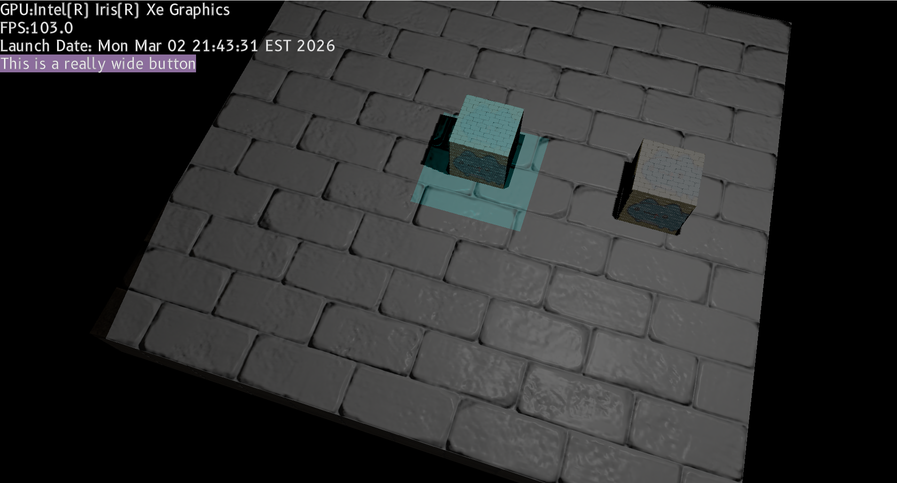

# Sky Engine

## Cross-platform 3D Java game engine
Sky is a game engine used for researching GPU driven rendering and their application in games. The goal is to provide a fast way to experiment with graphics techniques like compute shader post-processing, indirect rendering and BRDFs in real-time applications. 

Sky is written in Java, which makes cross-platform support easier compared to C++. Rendering is supported through Vulkan and shaders are written in Slang, although any language using SPIR-V is natively supported.

### Details

- Graphics are supported through a RHI supporting custom render pipelines including compute tasks. The only backend right now is Vulkan, but adding OpenGL ES to support Android is being considered
- 3D physics is provided via PhysX with Dominion as the ECS
- Shaders are reflected on at runtime to generate all descriptors on the fly. This makes writing custom shaders a lot easier and like OpenGL's, glUniformXYZ()...
- Kryo is used for asset pack de/serialization, but this might change soon
- The goal is to create a fully PBR engine with support for an editor, scripting, audio, 3D physics and cross-platform support

### Why Java

- Java is a much more ergonomic language to prototype with than C++
- While C++ engines are faster, Sky is aiming to explore the role of GPU-driven rendering, which means that the host language is not as important once the render loop is started 
- Java makes cross-platform support marginally easier as there are less platform specific concerns. While the bindings used do interact with platform-specific systems, they are abstracted away as much as possible. 

### License
Sky is licensed under the MIT license, available in the project root directory.