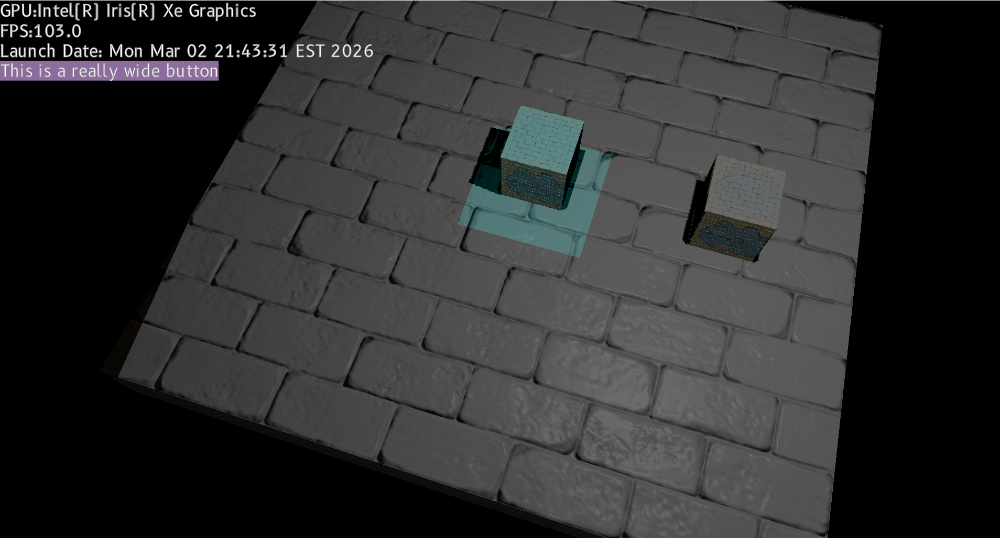
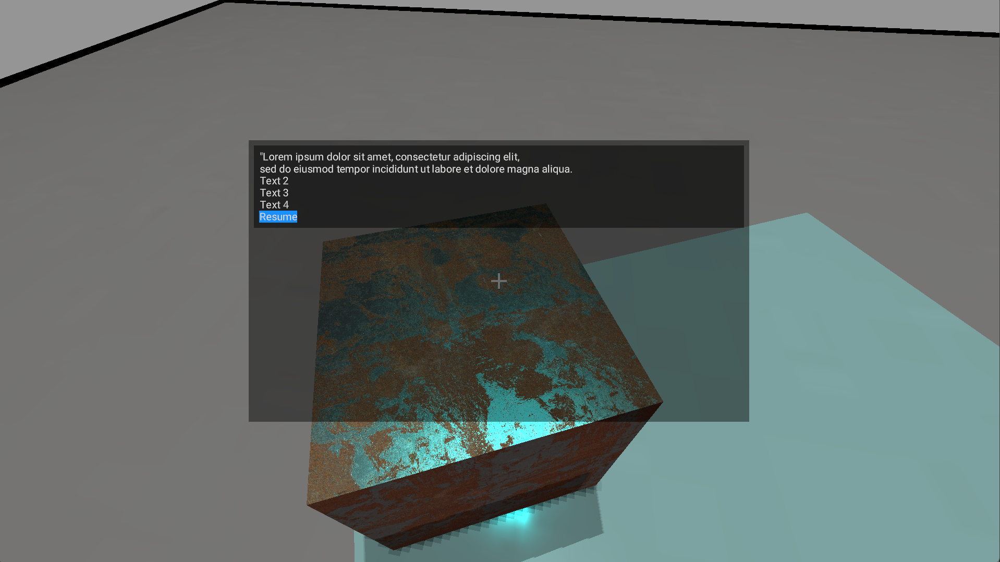
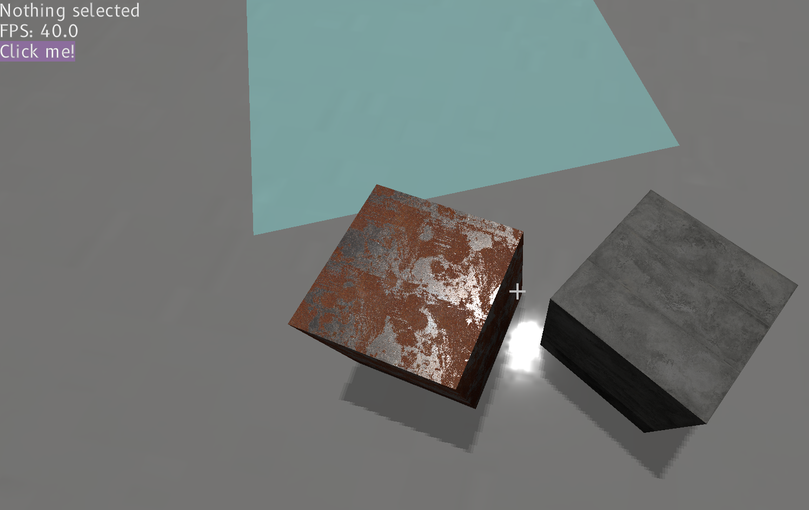

# Sky

## Cross-platform 3D Java game engine

Sky is a Vulkan-based game engine that I started developing in my free time as a way to cope with depression.

### Right now it supports:

- Render Hardware Interface for abstracting Vulkan calls
- Runtime SPIR-V shader reflection to find all uniforms
- Cook-Torrance PBR rendering with the metallic/roughness workflow
- 3D physics provided using JBullet
- Compute shader support
- Custom Actor hierarchy style ECS
- Asset Pack system
- Serialization via the Mio language compiler 
- Support for custom render pipelines
- Retained mode UI library

### Mio
- Mio is a custom serialization DSL designed for Sky to make hand-editing files, enforcing types and structure easier than with JSON

### License
Sky is licensed under the MIT license, available in the project root directory.